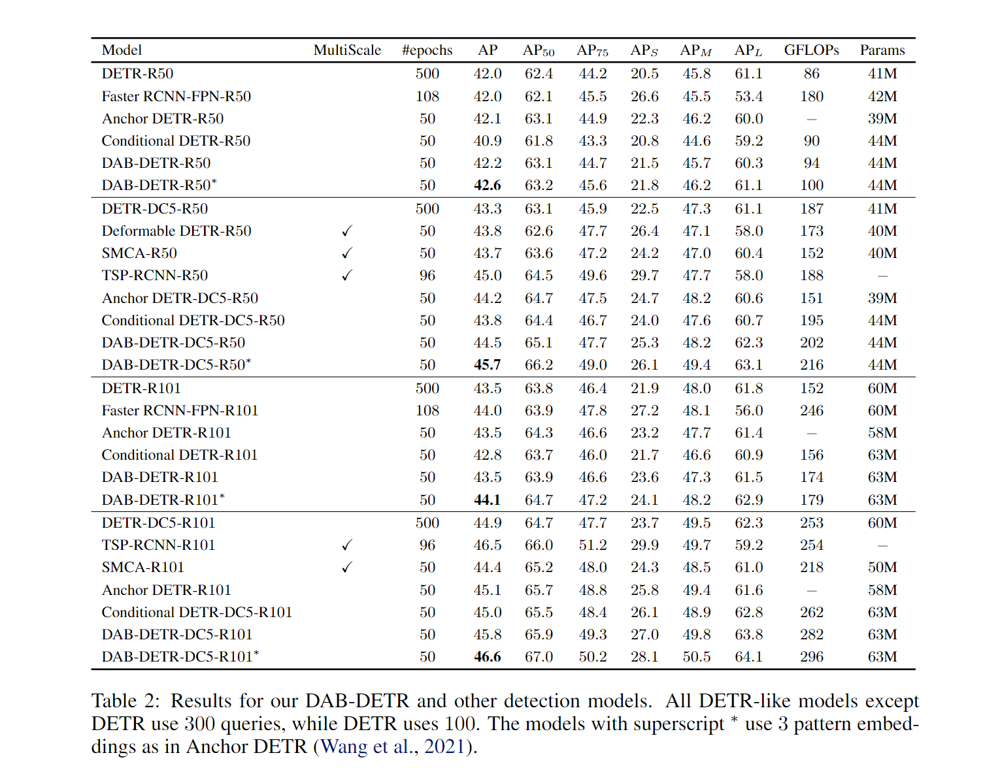
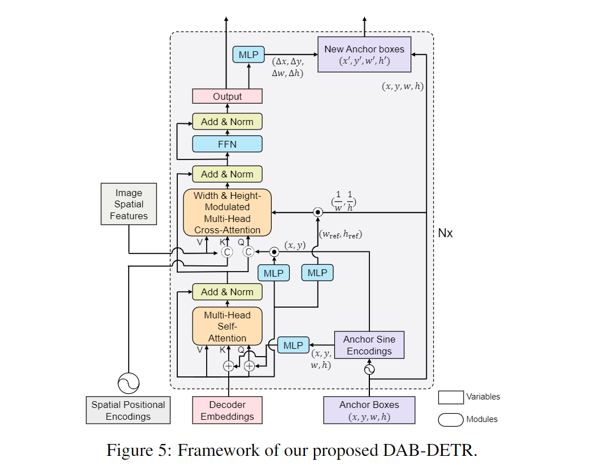
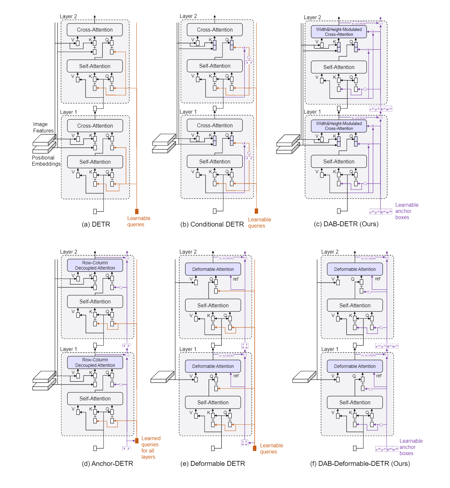

# DAB-DETR

This is the official pytorch implementation of our ICLR 2022 paper [DAB-DETR](https://arxiv.org/abs/2201.12329). 

Authors: [Shilong Liu](https://www.lsl.zone/), [Feng Li](https://scholar.google.com/citations?hl=zh-CN&user=ybRe9GcAAAAJ), [Hao Zhang](https://scholar.google.com/citations?user=B8hPxMQAAAAJ&hl=zh-CN), [Xiao Yang](https://ml.cs.tsinghua.edu.cn/~xiaoyang/), [Xianbiao Qi](https://scholar.google.com/citations?user=odjSydQAAAAJ&hl=en),   [Hang Su](https://www.suhangss.me/), [Jun Zhu](https://ml.cs.tsinghua.edu.cn/~jun/index.shtml), [Lei Zhang](https://www.leizhang.org/)

# News
[2022/9/22]: We release a toolbox [**detrex**](https://github.com/IDEA-Research/detrex) that provides state-of-the-art Transformer-based detection algorithms. It includes DINO **with better performance**. Welcome to use it! </br>
[2022/7/12]: Code for [DINO](https://arxiv.org/abs/2203.03605) is available now! [[code for DINO](https://github.com/IDEACVR/DINO)]. \
[2022/6]: We release a unified detection and segmentation model [Mask DINO](https://arxiv.org/pdf/2206.02777.pdf) that achieves the best results on all the three segmentation tasks (**54.5** AP on [COCO instance leaderboard](https://paperswithcode.com/sota/instance-segmentation-on-coco-minival), **59.4** PQ on [COCO panoptic leaderboard](https://paperswithcode.com/sota/panoptic-segmentation-on-coco-minival), and **60.8** mIoU on [ADE20K semantic leaderboard](https://paperswithcode.com/sota/semantic-segmentation-on-ade20k))! Code will be available [here](https://github.com/IDEACVR/MaskDINO). \
[2022/5/28] Code for [DN-DETR](https://arxiv.org/abs/2203.01305) is available [here](https://github.com/IDEA-opensource/DN-DETR)! \
[2022/5/22] We release a notebook for visualizion in [inference_and_visualize.ipynb](inference_and_visualize.ipynb). \
[2022/4/14] We release the [```.pptx``` file](resources/comparison_raleted_works_raw.pptx) of our [DETR-like models comparison figure](#comparison-of-detr-like-models) for those who want to draw model arch figures in paper.  \
[2022/4/12] We fix a bug in the file ```datasets/coco_eval.py```. The parameter ```useCats``` of ```CocoEvaluator``` should be ```True``` by default. \
[2022/4/9] Our code is available! \
[2022/3/9] We build a repo [Awesome Detection Transformer](https://github.com/IDEACVR/awesome-detection-transformer) to present papers about transformer for detection and segmenttion. Welcome to your attention! \
[2022/3/8] Our new work [DINO](https://arxiv.org/abs/2203.03605) set a new record of **63.3AP** on the MS-COCO leader board. [[code for DINO](https://github.com/IDEACVR/DINO)]. \
[2022/3/8] Our new work [DN-DETR](https://arxiv.org/abs/2203.01305) has been accpted by CVPR 2022! [[code for DN-DETR](https://github.com/IDEA-opensource/DN-DETR)]. \
[2022/1/21] Our work has been accepted to ICLR 2022.

# Abstract
We present in this paper a novel query formulation using dynamic anchor boxes for DETR (DEtection TRansformer) and offer a deeper understanding of the role of queries in DETR. This new formulation directly uses box coordinates as queries in Transformer decoders and dynamically updates them layer-by-layer. Using box coordinates not only helps using explicit positional priors to improve the query-to-feature similarity and eliminate the slow training convergence issue in DETR, but also allows us to modulate the positional attention map using the box width and height information. Such a design makes it clear that queries in DETR can be implemented as performing soft ROI pooling layer-by-layer in a cascade manner. As a result, it leads to the best performance on MS-COCO benchmark among the DETR-like detection models under the same setting, e.g., AP 45.7\% using ResNet50-DC5 as backbone trained in 50 epochs. We also conducted extensive experiments to confirm our analysis and verify the effectiveness of our methods.

# Model


<!-- # Results
 -->


# Model Zoo
We provide our models with R50 backbone, including both **DAB-DETR** and **DAB-Deformable-DETR** (See Appendix C of [our paper](https://arxiv.org/abs/2201.12329) for more details). 


<table>
  <thead>
    <tr style="text-align: right;">
      <th></th>
      <th>name</th>
      <th>backbone</th>
      <th>box AP</th>
      <th>Log/Config/Checkpoint</th>
      <th>Where in <a href="https://arxiv.org/abs/2201.12329">Our Paper</a></th>
    </tr>
  </thead>
  <tbody>
    <tr>
      <th>0</th>
      <td>DAB-DETR-R50</td>
      <td>R50</td>
      <td>42.2</td>
      <td><a href="https://drive.google.com/drive/folders/1ByfbyCZL8o6zOKqH6dQFCsVQ8dgRXfUU?usp=sharing">Google Drive</a>&nbsp;|&nbsp;<a href="https://cloud.tsinghua.edu.cn/d/3aa9d0da60e8423dab54/">Tsinghua Cloud</a></td>
      <td>Table 2</td>
    </tr>
    <tr>
      <th>1</th>
      <td>DAB-DETR-R50(3 pat)<sup><a id="sup1c" herf="#sup1">1</a></sup></td>
      <td>R50</td>
      <td>42.6</td>
      <td><a href="https://drive.google.com/drive/folders/1ByfbyCZL8o6zOKqH6dQFCsVQ8dgRXfUU?usp=sharing">Google Drive</a>&nbsp;|&nbsp;<a href="https://cloud.tsinghua.edu.cn/d/3aa9d0da60e8423dab54/">Tsinghua Cloud</a></td>
      <td>Table 2</td>
    </tr>
    <tr>
      <th>2</th>
      <td>DAB-DETR-R50-DC5</td>
      <td>R50</td>
      <td>44.5</td>
      <td><a href="https://drive.google.com/drive/folders/1ByfbyCZL8o6zOKqH6dQFCsVQ8dgRXfUU?usp=sharing">Google Drive</a>&nbsp;|&nbsp;<a href="https://cloud.tsinghua.edu.cn/d/3aa9d0da60e8423dab54/">Tsinghua Cloud</a></td>
      <td>Table 2</td>
    </tr>    
    <tr>
      <th>3</th>
      <td>DAB-DETR-R50-DC5-fixxy<sup><a id="sup2c" herf="#sup2">2</a></sup></td>
      <td>R50</td>
      <td>44.7</td>
      <td><a href="https://drive.google.com/drive/folders/1ByfbyCZL8o6zOKqH6dQFCsVQ8dgRXfUU?usp=sharing">Google Drive</a>&nbsp;|&nbsp;<a href="https://cloud.tsinghua.edu.cn/d/3aa9d0da60e8423dab54/">Tsinghua Cloud</a></td>
      <td>Table 8. Appendix H.</td>
    </tr>
    <tr>
      <th>4</th>
      <td>DAB-DETR-R50-DC5(3 pat)</td>
      <td>R50</td>
      <td>45.7</td>
      <td><a href="https://drive.google.com/drive/folders/1ByfbyCZL8o6zOKqH6dQFCsVQ8dgRXfUU?usp=sharing">Google Drive</a>&nbsp;|&nbsp;<a href="https://cloud.tsinghua.edu.cn/d/3aa9d0da60e8423dab54/">Tsinghua Cloud</a></td>
      <td>Table 2</td>
    </tr>
    <tr>
      <th>5</th>
      <td>DAB-Deformbale-DETR<br>(Deformbale Encoder Only)<sup><a id="sup3c" herf="#sup3">3</a></sup></td>
      <td>R50</td>
      <td>46.9</td>
      <td></td>
      <td>Baseline for <a href="https://arxiv.org/abs/2203.01305">DN-DETR</a></td>
    </tr>
    <!-- <tr>
      <th>6</th>
      <td>DAB-Deformable-DETR-R50<sup><a id="sup4c" herf="#sup4">4</a></sup></td>
      <td>R50</td>
      <td>48.1</td>
      <td><a href="https://drive.google.com/drive/folders/1ByfbyCZL8o6zOKqH6dQFCsVQ8dgRXfUU?usp=sharing">Google Drive</a>&nbsp;|&nbsp;<a href="https://cloud.tsinghua.edu.cn/d/3aa9d0da60e8423dab54/">Tsinghua Cloud</a></td>
      <td>Extend Results for Table 5,<br> Appendix C.</td>
    </tr> -->
    <tr>
      <th>6</th>
      <td>DAB-Deformable-DETR-R50-v2<sup><a id="sup4c" herf="#sup4">4</a></sup></td>
      <td>R50</td>
      <td>48.7</td>
      <td><a href="https://drive.google.com/drive/folders/1ByfbyCZL8o6zOKqH6dQFCsVQ8dgRXfUU?usp=sharing">Google Drive</a>&nbsp;|&nbsp;<a href="https://cloud.tsinghua.edu.cn/d/3aa9d0da60e8423dab54/">Tsinghua Cloud</a></td>
      <td>Extend Results for Table 5,<br> Appendix C.</td>
    </tr>
  </tbody>
</table>

Notes: 
- <sup><a id="sup1" herf="#sup1c">1</a></sup>: The models with marks (3 pat) are trained with multiple pattern embeds (refer to Anchor DETR or [our paper](https://arxiv.org/abs/2201.12329) for more details.). 
- <sup><a id="sup2" herf="#sup2c">2</a></sup>: The term "fixxy" means we use random initialization of anchors and do not update their parameters during training (See Appendix H of [our paper](https://arxiv.org/abs/2201.12329) for more details). 
- <sup><a id="sup3" herf="#sup3c">3</a></sup>: The DAB-Deformbale-DETR(Deformbale Encoder Only) is a multiscale version of our DAB-DETR. See [DN-DETR](https://arxiv.org/abs/2203.01305) for more details. 
- <sup><a id="sup4" herf="#sup4c">4</a></sup>: The result here is better than the number in our paper, as we use different losses coefficients during training. Refer to our config file for more details.


# Usage
## Installation
We use the great DETR project as our codebase, hence no extra dependency is needed for our **DAB-DETR**. For the **DAB-Deformable-DETR**, you need to compile the deformable attention operator manually.

We test our models under ```python=3.7.3,pytorch=1.9.0,cuda=11.1```. Other versions might be available as well.

1. Clone this repo
```sh
git clone https://github.com/IDEA-opensource/DAB-DETR.git
cd DAB-DETR
```

2. Install Pytorch and torchvision

Follow the instrction on https://pytorch.org/get-started/locally/.
```sh
# an example:
conda install -c pytorch pytorch torchvision
```

3. Install other needed packages
```sh
pip install -r requirements.txt
```

4. Compiling CUDA operators
```sh
cd models/dab_deformable_detr/ops
python setup.py build install
# unit test (should see all checking is True)
python test.py
cd ../../..
```

## Data
Please download [COCO 2017](https://cocodataset.org/) dataset and organize them as following:
```
COCODIR/
  ├── train2017/
  ├── val2017/
  └── annotations/
  	├── instances_train2017.json
  	└── instances_val2017.json
```


## Run
We use the standard **DAB-DETR-R50** and **DAB-Deformable-DETR-R50** as examples for training and evalulation.

### Inference with our pretrained models
See [inference_and_visualize.ipynb](inference_and_visualize.ipynb).

### Eval our pretrianed models

Download our DAB-DETR-R50 model checkpoint from [this link](https://drive.google.com/drive/folders/1pae4Yxi0H9OOFdXZg3zXuKK9yOznhTNU?usp=sharing) and perform the command below. 
You can expect to get the final AP about ```42.2```.

For our DAB-Deformable-DETR ([download here](https://drive.google.com/drive/folders/1uP9N0HIBPB6OPxLq5aqeIfKNOFFYQl2t?usp=sharing)), the final AP expected is ```48.7```.

```sh
# for dab_detr: 42.2 AP
python main.py -m dab_detr \
  --output_dir logs/DABDETR/R50 \
  --batch_size 1 \
  --coco_path /path/to/your/COCODIR \ # replace the args to your COCO path
  --resume /path/to/our/checkpoint \ # replace the args to your checkpoint path
  --eval

# for dab_deformable_detr: 48.7 AP
python main.py -m dab_deformable_detr \
  --output_dir logs/dab_deformable_detr/R50 \
  --batch_size 2 \
  --coco_path /path/to/your/COCODIR \ # replace the args to your COCO path
  --resume /path/to/our/checkpoint \ # replace the args to your checkpoint path
  --transformer_activation relu \
  --eval
```


### Training your own models
Similarly, you can also train our model on a single process: 
```sh
# for dab_detr
python main.py -m dab_detr \
  --output_dir logs/DABDETR/R50 \
  --batch_size 1 \
  --epochs 50 \
  --lr_drop 40 \
  --coco_path /path/to/your/COCODIR  # replace the args to your COCO path
```


### Distributed Run
However, as the training is time consuming, we suggest to train the model on multi-device.

If you plan to train the models on a cluster with Slurm, here is an example command for training:
```sh
# for dab_detr: 42.2 AP
python run_with_submitit.py \
  --timeout 3000 \
  --job_name DABDETR \
  --coco_path /path/to/your/COCODIR \
  -m dab_detr \
  --job_dir logs/DABDETR/R50_%j \
  --batch_size 2 \
  --ngpus 8 \
  --nodes 1 \
  --epochs 50 \
  --lr_drop 40 

# for dab_deformable_detr: 48.7 AP
python run_with_submitit.py \
  --timeout 3000 \
  --job_name dab_deformable_detr \
  --coco_path /path/to/your/COCODIR \
  -m dab_deformable_detr \
  --transformer_activation relu \
  --job_dir logs/dab_deformable_detr/R50_%j \
  --batch_size 2 \
  --ngpus 8 \
  --nodes 1 \
  --epochs 50 \
  --lr_drop 40 
```

The final AP should be similar to ours. (```42.2``` for **DAB-DETR** and ```48.7``` for **DAB-Deformable-DETR**). Our configs and logs(see the [model_zoo](#model-zoo)) could be used as references as well. 

Notes: 
  - The results are sensitive to the batch size. We use 16(2 images each GPU x 8 GPUs) by default.


Or run with multi-processes on a single node:
```sh
# for dab_detr: 42.2 AP
python -m torch.distributed.launch --nproc_per_node=8 \
  main.py -m dab_detr \
  --output_dir logs/DABDETR/R50 \
  --batch_size 2 \
  --epochs 50 \
  --lr_drop 40 \
  --coco_path /path/to/your/COCODIR

# for dab_deformable_detr: 48.7 AP
python -m torch.distributed.launch --nproc_per_node=8 \
  main.py -m dab_deformable_detr \
  --output_dir logs/dab_deformable_detr/R50 \
  --batch_size 2 \
  --epochs 50 \
  --lr_drop 40 \
  --transformer_activation relu \
  --coco_path /path/to/your/COCODIR
```


# Detailed Model


# Comparison of DETR-like Models
The source file can be found [here](./resources/comparison_raleted_works_raw.pptx).




# Links
<p>
<font size=3><b>DINO: DETR with Improved DeNoising Anchor Boxes for End-to-End Object Detection.</b></font>
<br>
<font size=2>Hao Zhang*, Feng Li*, <b>Shilong Liu*</b>, Lei Zhang, Hang Su, Jun Zhu, Lionel M. Ni, Heung-Yeung Shum</font>
<br>
<font size=2>arxiv 2022.</font>
<br>
<a href='https://arxiv.org/abs/2203.03605'>[paper]</a> <a href='https://github.com/IDEACVR/DINO'>[code]</a>  
</p>

<p>
<font size=3><b>DN-DETR: Accelerate DETR Training by Introducing Query DeNoising.</b></font>
<br>
<font size=2>Feng Li*, Hao Zhang*, <b>Shilong Liu</b>, Jian Guo, Lionel M. Ni, Lei Zhang.</font>
<br>
<font size=2>IEEE Conference on Computer Vision and Pattern Recognition (<b>CVPR</b>) 2022.</font>
<br>
<a href='https://arxiv.org/abs/2203.01305'>[paper]</a> <a href='https://github.com/IDEA-opensource/DN-DETR'>[code]</a>    
</p>

# License
DAB-DETR is released under the Apache 2.0 license. Please see the [LICENSE](LICENSE) file for more information.

Copyright (c) IDEA. All rights reserved.

Licensed under the Apache License, Version 2.0 (the "License"); you may not use these files except in compliance with the License. You may obtain a copy of the License at http://www.apache.org/licenses/LICENSE-2.0

Unless required by applicable law or agreed to in writing, software distributed under the License is distributed on an "AS IS" BASIS, WITHOUT WARRANTIES OR CONDITIONS OF ANY KIND, either express or implied. See the License for the specific language governing permissions and limitations under the License.


# Citation
```bibtex
@inproceedings{
  liu2022dabdetr,
  title={{DAB}-{DETR}: Dynamic Anchor Boxes are Better Queries for {DETR}},
  author={Shilong Liu and Feng Li and Hao Zhang and Xiao Yang and Xianbiao Qi and Hang Su and Jun Zhu and Lei Zhang},
  booktitle={International Conference on Learning Representations},
  year={2022},
  url={https://openreview.net/forum?id=oMI9PjOb9Jl}
}
```