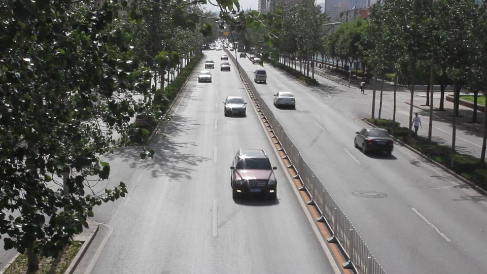
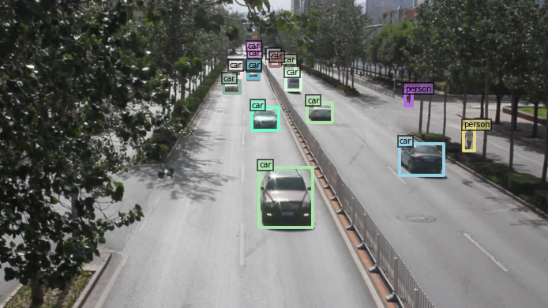

# 代码说明

## :house:项目结构

```text
DETR/
├── ckpts                  # 模型参数
├── coco                   # coco数据集
├── datasets               # 处理与加载数据集脚本
├── models                 # 模型脚本
├── results                # 结果
├── test                   # 测试数据
├── util                   # 工具
├── run_with_submitit.py   # 提交结果
├── engine.py              # 训练和验证工具
├── main.py                # 训练和验证脚本
├── infer_image.py         # 推理图片脚本
├── infer_video.py         # 推理视频脚本
├── infer_image2video.py   # 推理图片生成视频脚本
├── easy_run.ipynb         # 简易运行脚本
├── README.md              # 说明文档
└── requirements.txt       # 环境配置文件
```

## :wrench:环境配置

### :one:依赖

+ conda
+ cuda=11.x
+ cudnn
+ python=3.8
+ jupyter
+ torch
+ torchvision
+ opencv-python
+ timm
+ cython
+ pycocotools
+ submitit
+ panopticapi
+ scipy
+ termcolor
+ addict
+ yapf

### :two:步骤

1. 创建虚拟环境

    ```shell
    conda create -n detr python=3.8
    conda activate detr
    ```

2. 安装pkg

    ```shell
    pip install torch torchvision
    pip install -r requirements.txt
    ```

3. 测试

    ```shell
    python
    import torch
    torch.cuda.is_available()
    ```

4. 编译CUDA算子

    ```shell
    cd models/dab_deformable_detr/ops
    python setup.py build install
    python test.py
    cd ../../..
    ```

## :thinking:使用说明

### 预训练模型

将预训练模型存放在ckpts目录下,使用DAB-DETR/R50,目录结构如下:

```shell
ckpts/
  └── DAB_DETR
        └── R50
            ├── checkpoints.pth
            └── config.json
            └── log.txt
```

### coco数据集

将coco数据集存放在coco目录下,目录结构如下:

```shell
coco/
  ├── train2017/
  ├── val2017/
  └── annotations/
        ├── instances_train2017.json
        └── instances_val2017.json
```

### 测试数据

测试数据包括,随机图片数据\视频\图片序列(DETRAC数据集),对应文件夹为image\video\image2video

```shell
test/
  ├── image/
  ├── image2video/
  └── video/
```

### 保存结果

将coco训练结果\coco验证结果\随机图片推理结果\视频推理结果\图像序列推理结果存放在coco_eval\coco_train\image\video\image2video中,结构如下:

```shell
results/
  ├── coco_eval/
  ├── coco_train/
  ├── image/
  ├── image2video/
  └── video/
```

### :rocket:运行:rocket:

#### ipynb运行(推荐)

打开`easy_run.ipynb`,将要检测的数据放在`test`的对应目录下,运行即可.

#### 终端运行

打开终端,进入DTER目录,输入`python ./xxx.py [option]`即可运行

> `xxx.py` 为对应python脚本,`[option]`为脚本的参数选项,可以使用`python ./xxx.py -h`查看全部选项

##### 示例

+ 推理图片:

    ```shell
    python ./infer_image.py --show_savename True
    ```

+ 推理视频

    ```shell
    python ./infer_video.py --video_path ./test/video --save_path ./results/video
    ```

+ 推理图片序列

    ```shell
    python infer_image2video.py --image_path "./test/image2video/DETRAC-test-data/Insight-MVT_Annotation_Test/MVI_39271"
    ```

+ coco验证

    ```shell
    python main.py -m dab_detr --output_dir ./results/eval_coco --batch_size 1 --coco_path ./coco --resume ./ckpts/DAB_DETR/R50/checkpoint.pth --eval
    ```

+ coco训练

    ```shell
    python main.py -m dab_detr --output_dir ./results/coco_train --batch_size 1 --coco_path ./coco --epochs 50 --lr_drop 40
    ```

## :collision:结果展示

|模式|原数据|图片效果|
|---|---|---|
|图片|||
|视频|||
|图片序列|-||